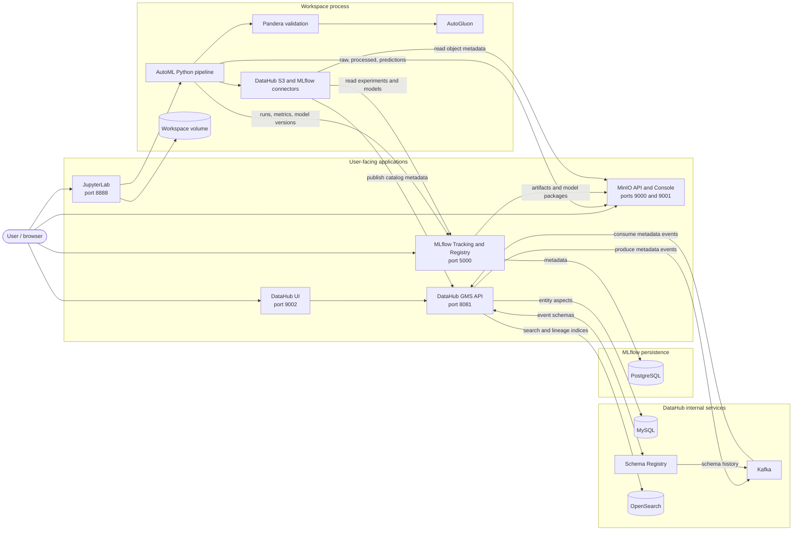
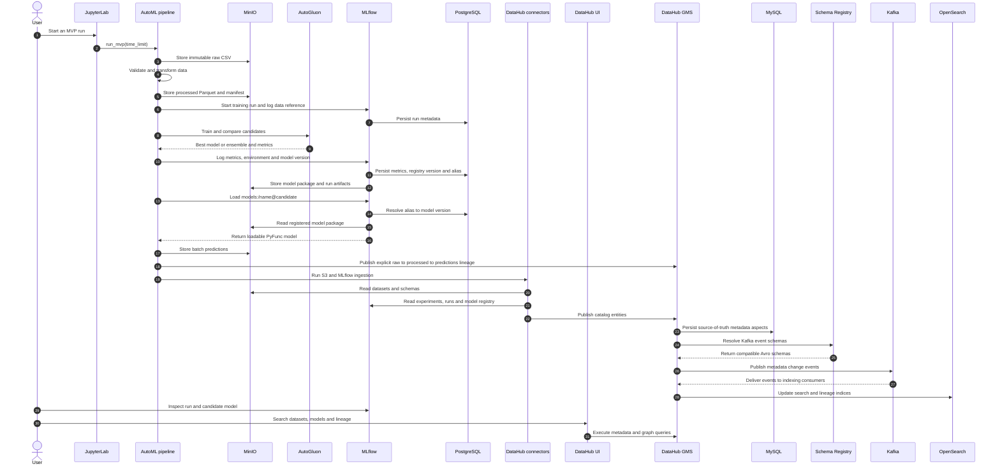

# Torii — AutoML Workshop Stack

Praktyczne ćwiczenia i scenariusze demonstracyjne znajdują się w
[`automl-workshops.md`](automl-workshops.md).

This local stack demonstrates the smallest useful model-management path around
an ML compute platform. It is not a production serving platform. Its purpose is
to make a model run reproducible and discoverable from data snapshot through
registered model to batch predictions.

## What is included

| Area | Tool | What the MVP demonstrates |
|---|---|---|
| Development | JupyterLab or optional code-server | Interactive exploration with reusable pipeline code outside the notebook |
| Data storage | MinIO | Immutable raw and processed snapshots, prediction outputs and MLflow artifacts |
| Data validation | Pandera | Schema, null, uniqueness and target-domain checks before training |
| Transformation | Torii Python pipeline | Column normalization, deterministic deduplication and Parquet materialization |
| AutoML | AutoGluon Tabular | Time-bounded comparison and ensembling of trusted model families |
| Tracking and registry | MLflow | Parameters, data reference, metrics, environment, artifacts, model version and `candidate` alias |
| Catalog and lineage | DataHub | Searchable MinIO datasets, MLflow experiments/models and raw -> processed -> predictions lineage |
| Consumption proof | MLflow PyFunc | A separate batch step loads the registered alias rather than an in-memory predictor |

The flow shown by the demo is:

```text
scikit-learn source
        |
        v
MinIO raw CSV -- validation + transform --> MinIO processed Parquet
                                              |              |
                                              |              v
                                              |       DataHub catalog/lineage
                                              v
                                      AutoGluon training
                                              |
                         MLflow run + registered candidate model
                                              |
                                              v
                                    MinIO batch predictions
```

## Architecture and persistence

The notebook is only the development interface. Reusable Python code performs
the work, while state is kept outside the Jupyter process:

### Applications, databases and dependencies



Only the five application ports shown above are published to the host. The
databases and DataHub infrastructure communicate on the private Compose network.

### End-to-end training session



### Session and state lifetime

| State | Lifetime | Persistent location |
|---|---|---|
| Browser and DataHub login session | Temporary; can be recreated | Browser/container memory |
| Jupyter kernel variables | Temporary; lost after kernel restart | Process memory only |
| Notebook and project files | Persistent across container restarts | Docker workspace volume |
| AutoGluon working directory during training | Temporary | Container `/tmp` |
| Packaged trained model | Persistent | MinIO `mlflow` bucket |
| MLflow run, metrics, model version and aliases | Persistent | PostgreSQL, with artifacts in MinIO |
| Raw, processed and prediction datasets | Persistent and content/run addressed | MinIO `automl-data` bucket |
| DataHub entities and lineage | Persistent | MySQL; searchable projection in OpenSearch |
| DataHub metadata events and schemas | Persistent | Kafka and Schema Registry |

Restarting a Jupyter kernel therefore removes Python variables but does not
remove a completed MLflow run or model. Replacing containers also preserves
state while the Docker volumes remain. `docker compose down -v` is different:
it removes those volumes and should not be used when the state must survive.

The databases and storage services are intentional:

| Service | Persistent data | Why it is present |
|---|---|---|
| PostgreSQL | MLflow experiments, runs, parameters, metrics and model-registry records | A durable relational backend is appropriate for a shared MLflow server; SQLite would only be suitable for a very small single-user demo |
| MinIO | Data snapshots, predictions and binary MLflow artifacts/model packages | It provides a local S3-compatible object store; in AWS/GCP this maps naturally to S3 or GCS |
| MySQL | DataHub entity aspects and catalog metadata | This is DataHub's source-of-truth metadata store in the local quickstart architecture |
| OpenSearch | DataHub search indices and lineage graph index | It makes catalog search and graph navigation fast; it is derived from DataHub metadata, not the primary store |
| Kafka | DataHub metadata change events | It decouples ingestion from indexing and other metadata consumers |
| Schema Registry | Avro schemas used for DataHub's Kafka events | It prevents producers and consumers from interpreting metadata events differently; its schemas are persisted in Kafka |
| Docker workspace volume | Notebooks, source files and reports under `/workspace` | It preserves user work when the workspace container is replaced |

Therefore the MVP does need databases. PostgreSQL is required by the chosen
MLflow architecture, while MySQL, OpenSearch, Kafka and Schema Registry are the
supporting DataHub quickstart stack. JupyterLab, AutoGluon and the transformation
code do not require their own database. In a production AWS/GCP deployment,
these local containers should normally be replaced by managed services and
backed up according to the platform's recovery requirements.

## Prerequisites

Docker Desktop must be running in Linux-container mode. DataHub recommends at
least 2 CPUs, 8 GB RAM, 2 GB swap and 13 GB free disk for its own local
quickstart. Giving Docker Desktop about 10-12 GB RAM is more comfortable when
AutoGluon is training at the same time.

If Docker reports a missing `dockerDesktopLinuxEngine` named pipe, start Docker
Desktop and wait until its engine status is **Running** before retrying.

If Docker Desktop itself exits with `initializing Inference manager` and a
`dockerInference` path error, Compose has not started yet. This is a reported
[Docker Desktop for Windows startup bug](https://github.com/docker/desktop-feedback/issues/625),
not a Torii configuration error. Install a Docker Desktop release containing
the fix (or use a known working release); do not use **Reset to factory
defaults** without backing up Docker volumes because it removes local stack
state.

## Start the stack

Run from the `docker-images-ml` directory:

```powershell
docker compose -f compose.demo.yaml up --build -d
docker compose -f compose.demo.yaml ps
```

DataHub performs a one-time storage migration during the first start. Its UI
can take roughly two minutes to become available after the other pages start.
PostgreSQL, MySQL, OpenSearch, Kafka and Schema Registry are internal-only and
do not publish host ports.
Follow startup if necessary:

```powershell
docker compose -f compose.demo.yaml logs -f datahub-gms datahub-frontend
```

## Run the complete demo

The quickest path is one command from PowerShell:

```powershell
docker compose -f compose.demo.yaml exec workspace `
  python -m torii_project.automl.mvp 120
```

The number is the AutoGluon time budget in seconds. The same command can be run
in a JupyterLab terminal without the `docker compose ... exec workspace` part:

```bash
python -m torii_project.automl.mvp 120
```

For a guided notebook version, open `notebooks/automl_mvp.py` in JupyterLab.
The pipeline performs these operations in order:

1. snapshots the built-in breast-cancer dataset to MinIO;
2. validates its schema, missing values, row identifiers and binary target;
3. normalizes column names and writes a content-addressed Parquet snapshot;
4. trains and evaluates AutoGluon and logs everything to MLflow;
5. registers the model and points the `candidate` alias at the new version;
6. reloads the model through the MLflow Registry API and writes batch predictions;
7. ingests MinIO and MLflow metadata and publishes lineage to DataHub.

Re-running the command creates a new MLflow run and model version. Identical
input and processed data reuse the same content-addressed MinIO paths.

## Pages and credentials

| Page | Address | Local credentials |
|---|---|---|
| JupyterLab | <http://localhost:8888> | token `torii-local-dev` |
| MLflow | <http://localhost:5000> | none |
| MinIO console | <http://localhost:9001> | `minioadmin` / `minioadmin` |
| DataHub | <http://localhost:9002> | `datahub` / `datahub` |
| DataHub API/health | <http://localhost:8081/health> | none in the local MVP |

All credentials and ports are development defaults. Do not expose this stack
outside the local machine.

## What to inspect

### MLflow

1. Open **Experiments** and select `automl-end-to-end-mvp`.
2. Open `autogluon-candidate-training` to see parameters, evaluation metrics,
   the input dataset, the validation manifest, environment and leaderboard.
3. Open **Models** and select `automl-breast-cancer-classifier`.
4. Confirm that the newest version has alias `candidate`.
5. The separate `candidate-batch-inference` run proves that consumption uses
   the Registry alias, not the predictor object left in notebook memory.

### MinIO

Open **Object Browser**. Two buckets should exist:

- `mlflow`: model packages, run artifacts and reports managed by MLflow;
- `automl-data`: data owned by the AutoML pipeline.

Inside `automl-data`:

- `raw/breast-cancer/sha256=.../data.csv` is the immutable source snapshot;
- `processed/breast-cancer/sha256=.../data.parquet` is the validated training data;
- the adjacent `manifest.json` explains validation and transformations;
- `predictions/breast-cancer/run_id=.../predictions.parquet` is the batch output.

### DataHub

After the demo finishes, search for `breast-cancer` and
`automl-breast-cancer-classifier`:

- S3 datasets expose paths and inferred schemas;
- MLflow entities expose the experiment, runs, registered model and versions;
- on the processed dataset's **Lineage** tab, the raw snapshot is upstream;
- on the predictions dataset's **Lineage** tab, the processed snapshot is upstream.

MLflow's DataHub connector also imports dataset inputs logged with
`mlflow.log_input`, providing the relationship between a training run and its
data reference. The connector runs in an isolated Python environment because
DataHub 1.7.0 currently supports an older MLflow client than the MLflow 3.14
client used for training; both still communicate through the server API.

## Useful operations

Check only the service state:

```powershell
docker compose -f compose.demo.yaml ps
```

Stop containers while preserving all data:

```powershell
docker compose -f compose.demo.yaml down
```

Start them again with the same MLflow, MinIO, DataHub and workspace contents:

```powershell
docker compose -f compose.demo.yaml up -d
```

To use code-server instead of JupyterLab:

```powershell
docker compose -f compose.demo.yaml -f compose.vscode.yaml up --build -d
```

Then open <http://localhost:8080> with password `torii-local-dev`.

Deleting volumes is intentionally not part of the normal workflow because it
removes experiments, models, objects, catalog metadata and workspace files.

## What remains outside this MVP

The next production-oriented steps would be an orchestrator such as Argo
Workflows or Kubeflow Pipelines, automated promotion gates from `candidate` to
`champion`, deployment/serving, live quality and drift monitoring, RBAC/SSO,
secrets, backups and managed cloud storage. Those are deliberately excluded so
the first demo remains understandable and runnable on one workstation.

DataHub local quickstart is also not a production deployment; DataHub's
production path is Kubernetes. The same separation applies to the local MinIO
and PostgreSQL/MySQL services included here.
